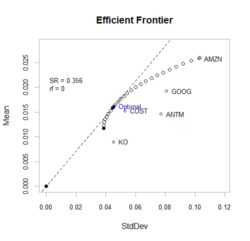
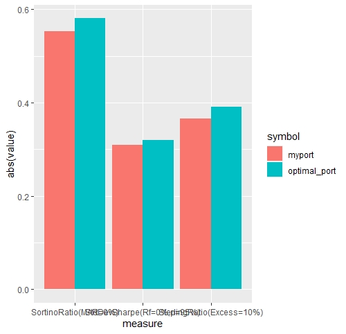

# Portfolio Optimization Using R

## Packages Used 
-tidyverse
-tidyquant
-portfolioanalytics
-ROI

## Objects 

### tickers
Stores the stock price history over a given period in a tibble dataframe

### stocks_wide
Pivots row observations from tickers to date for easier analysis - uses timetk functionality

### port_spec 
portfolio.spec function used for preparing optimization by specifying that the columns of stocks_wide will be used for optimization
add.constraint used defined parameters for portfolio weights = to 1
add.constraint used for second condition allows for between 0 and 100% weighting of each asset

### port_spec
add.objective used to set objectives for measuring risk and return with standard deviation, and mean, respectively.

### opt
uses optimize.portfolio to run the optimization functionality within the portfolioanalytics package by letting it know we want to use stocks_wide as our data and port_spec as our constraints

Print(opt)
***********************************
PortfolioAnalytics Optimization
***********************************
Call:
optimize.portfolio(R = stocks_wide, portfolio = port_spec, optimize_method = "ROI", 
    trace = TRUE, maxSR = TRUE)

Optimal Weights:
  COST   GOOG   AMZN   ANTM     KO 
0.3902 0.1167 0.1615 0.1419 0.1924 

Objective Measure:
StdDev 
0.0453 

   mean 
0.01611 
************************************
### wt
uses extractWeights to pull data from the optimization calculations

### wt_1
converts wt to dateframe

### optimal_port
add optimization results to tq_portfolio

### myport
creates equally-weighted portfolio of same tickers for comparative analysis

### opSort
calculates sortino ratio for optimal_port

### mySort
calculates sortino ratio for myport

### opSharpe
calculates sharpe ratio for optimal_port

### mySharpe
calculates sharpe ratio for myport

### opSterl
calculates sterling ratio for optimal_port

### mySterl
calculates sterling ratio for myport

### all_sort
rbind mySort and opSort

### all_sharpe
rbind mySharpe and opSharpe

### all_sterling
rbind mySterl and opSterl

### fun_combined
inner join all_sort and all_sharpe

### fun_combined2
inner join fun_combined and all_sterl

### fun_combined3
pivot longer to change columns to measure and value to prepare for visualiztion

## Plots
### add description here

### add description here

